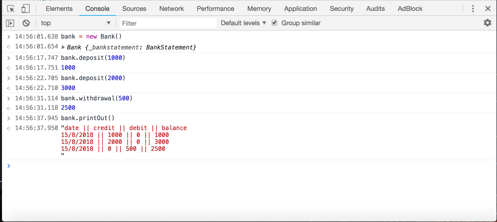

# Bank.js

## Introduction
Build a bank system that allow user deposit/withdrawal and check their bank statement

## How to install?

#### How to run the test?
- 11 tests are passed
```
$ git clone https://github.com/jeff1108/Bank.js.git
$ cd Bank.js
$ open SpecRunner.html
```


#### How to run the code?
- Open any web bowsers (Google Chrome/ Firefox)
- Open the "Console"
- Type:
```
bank = new Bank();
bank.deposit(1000);  -- on 10/01/2012
bank.deposit(2000);  -- on 13/01/2012
bank.withdraw(500);  -- on 14/01/2012
bank.printout();
```
- Output:
```
date || credit || debit || balance
14/01/2012 || || 500.00 || 2500.00
13/01/2012 || 2000.00 || || 3000.00
10/01/2012 || 1000.00 || || 1000.00
```
---
## Technical

#### Tech
- Javascript
- Jasmine

#### Topic Covered
- TDD
- Javascript
- Jasmine as test framework
- Unit test, Feature test
- Using Single Responsibility Principle
- Mocking (mock the date)
- Ensuring code is DRY
---
## Approach
1.Write the User Story:

```
As a User
So I can save my money
I would like to deposit in bank

As a User
So I can get my money
I want to withdrawal in bank

As a User
So I can see my transaction
I would like to print out my bank statement

As a User
So I can see when I deposit/withdrawal in bank
I would like to check my transaction date
```

2.Apply TDD process
- Write a test first, run it and see if the new one fails.
- Write code to make it pass
- Refactor the code.
- Repeat the above step

3.Think about how many class I need base on Single Responsibility Principle
- Bank -------------------provide base function in ATM
- Bank Statement --------record the transaction
---
## Implementation
Step1: Set bank balance equal 0

Step2: Create deposit method

Step3: Create withdrawal method

Step4: Create a array called "transaction" to record all bank transaction,
- Push the each transaction hashes to bank statement array

- `[{current_time: 14/01/2012, amount:0, balance: 0}]`

Step5: Mocking the time
- Installed with a call to jasmine.clock().install in a spec that needs to manipulate time
- Uninstall the clock after the you done to restore the original function

Step6: Separate the amount to debt/credit amount in bank statement
- `[{current_time: 14/01/2012, credit: 0, debit: 0, balance: 0}]`

Step7: Separate to two class base on Simple Responsibility Principle

```
Bank                                     
- deposit
- withdrawal
- printOut

BankStatement
- record
- allTransaction
- list
- time
```

Step8: Create allTransaction method in class BankStatement to format the bank statement by using loop method
----

## Example

